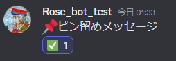

# Rose Discord Bot

## 概要

これは、[Discord](https://discord.com/)上で動作するBotです。Discord上の[ピン留め](https://support.discord.com/hc/ja/articles/221421867-How-do-I-pin-messages-)機能を権限不要で簡易に行うものです。

## 機能紹介

ピン留めしたいメッセージに特定のキーワード[^pin_key]を含めることにより、特定のチャネル[^check_key]にBotがメッセージを投稿します。

- 元メッセージ</br>
    

- 投稿先チャネル</br>
    

- Botによる投稿メッセージ</br>
    

## 使用方法

### 投稿者

- ピン留めをする(Botによるメッセージ投稿を行う)
  - 以下のアイコンのいずれかをメッセージ内に記載する。
    `"📌", "📍"` [^pin_key]</br>
    

- ピン留めを外す(Botによるメッセージ投稿を削除する)
  - 投稿元メッセージに、以下のいずれかのリアクションを付与する。
    `"✅", "☑️", "✔️"` [^check_key]</br>
    
  - 投稿元メッセージを編集し、アイコンをメッセージ内から削除する。</br>
    
  - 投稿元メッセージを削除する。

- 自身の全てのピン留めを外す(Botによるメッセージ投稿を一括削除する)
  - `!clear`とメッセージ(コマンド)を投稿する。</br>
    

### 投稿者以外のユーザー

- Botの投稿を黒ガードにして目立たなくする。(投稿者が削除する前に見る必要がないことを示す。)
  - 当該のBot投稿に対し、何らかのリアクションを付与する。</br>
    

### 管理者

- ピン留めを外す(Botによるメッセージ投稿を削除する)
  - Botのメッセージを直接削除する

- 全てのピン留めを外す(Botによるメッセージ投稿を一括削除する)
  - `!clear_all`とメッセージ(コマンド)を投稿する。</br>
    

### その他

- 毎週火曜日、午前4時(JST)[^clear_time]に、前日までのBot投稿のうち、黒ガードされている投稿を自動的に削除します。

## Bot導入方法

必ず、事前準備を行ってからBotの招待をするようにお願いします。間違って、先にBotを招待してしまった場合、Botを一度キックし、事前準備を行った後、再度Botを招待してください。

### 事前準備

特定の名前[^channel_name]のチャネルをBotを導入したいサーバに立ててください。</br>
    

### Botの招待

以下のURLからBotを招待してください。</br>
`https://discord.com/api/oauth2/authorize?client_id=1133287177732759593&permissions=339008&scope=bot`


## カスタマイズ
ピン留めを行うためのキーワードや投稿先のチャネル名、Botによる投稿の自動削除などをカスタマイズしたい場合、main.py内の以下の部分を適宜修正したBotを自身のサービスとして起動させてください。その際、BotのTokenは環境変数`TOKEN`として設定をお願いします。

``` python
#########################################
# USER 環境変数の設定
KEYWORDS_PIN = ["📌", "📍"]
KEYWORDS_CHECK = ["✅", "☑️", "✔️"]

-------------------------

# 自動削除関係の時間設定
CLEAN_ACTIVE = True  # 自動削除を行うか否か
ZONE = ZoneInfo("Asia/Tokyo")
CLEAN_TIME = time(hour=4, minute=0, second=0, tzinfo=ZONE)
CLEAN_DAY = 1  # 0:月曜日、1:火曜日
```

[^pin_key]:`"📌", "📍"` main.py内該当部により変更可能
[^check_key]:`"✅", "☑️", "✔️"` main.py内該当部により変更可能
[^channel_name]:`簡易ピン留め` main.py内該当部により変更可能
[^clear_time]:`毎週火曜日、午前4時 (JST)` main.py内該当部により変更可能
